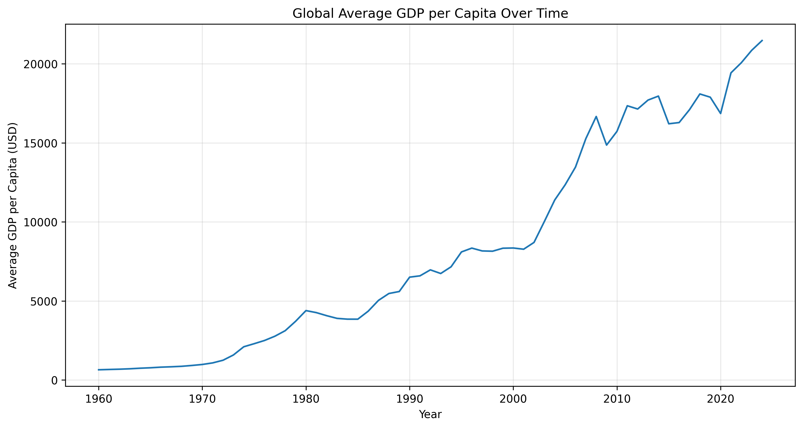
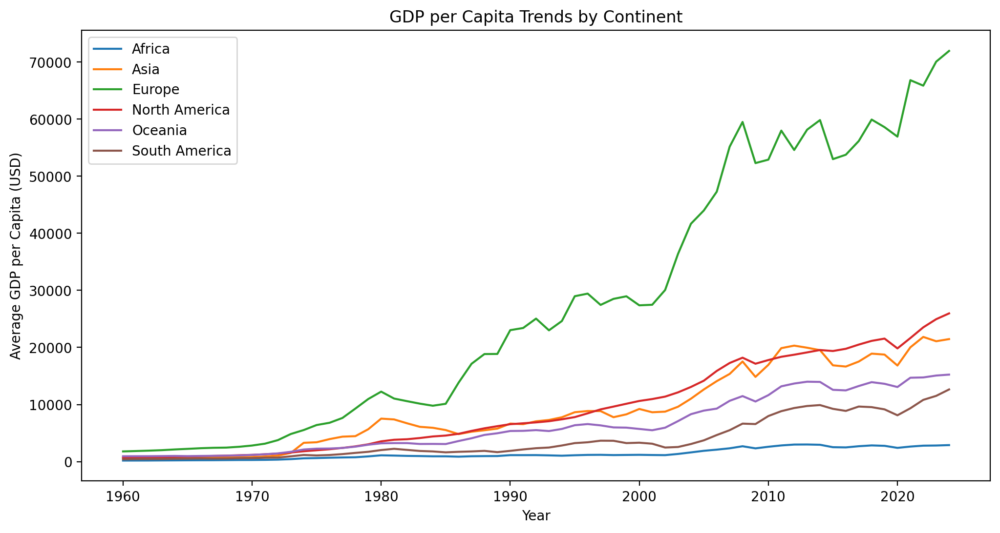
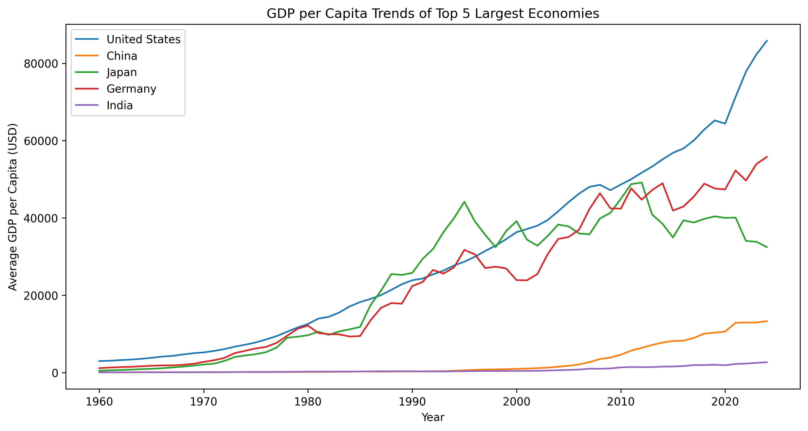
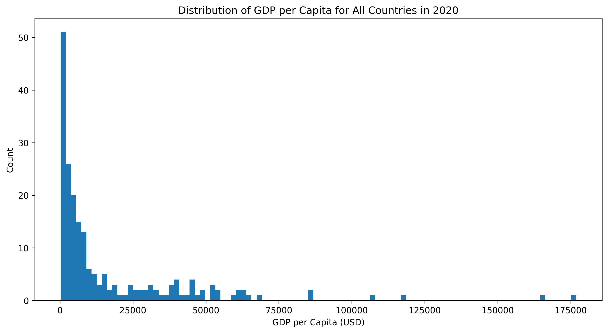
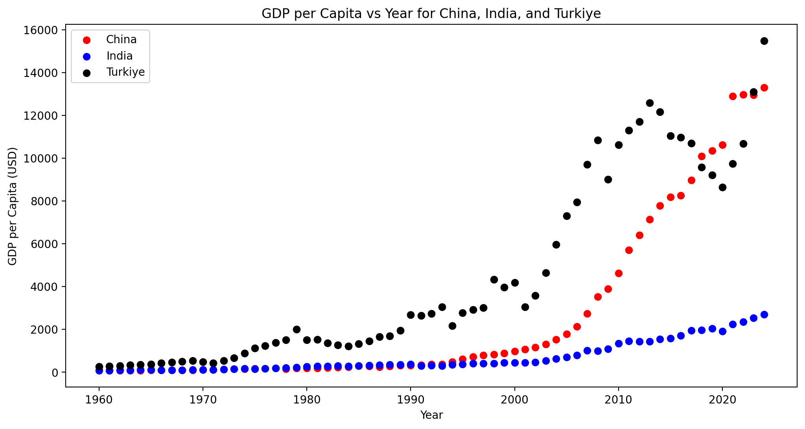
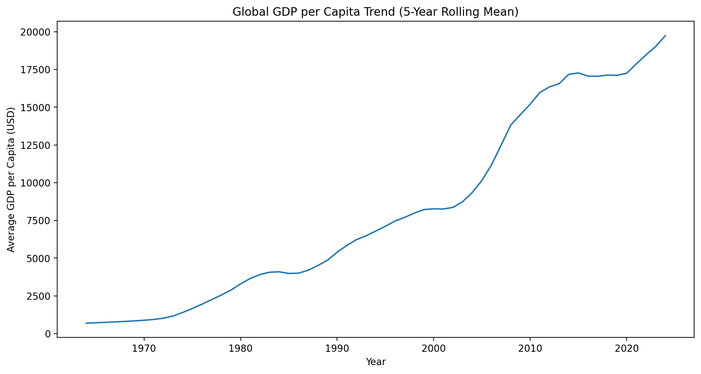

# Global GDP per Capita Analysis

Analyze World Bank GDP per capita (current US$) by country and year. The notebook reshapes raw data, cleans missing
values, computes summary statistics, and produces visualizations and tables.

## Data

- World Bank GDP per capita: data/API_NY.GDP.PCAP.CD_DS2_en_csv_v2_122367.csv
- Country → Continent mapping: data/country-and-continent-codes-list.csv

## Environment and setup

- Python 3.10+
- Install dependencies

```bash
python -m venv .venv
source .venv/bin/activate  # Windows: .venv\Scripts\activate
pip install -r requirements.txt
```

- Launch Jupyter

```bash
jupyter lab  # or: jupyter notebook
```

## How to run

1) Open `sample.ipynb`.
2) Run cells top-to-bottom.
3) Figures and tables are saved under `assets/figures` and `assets/tables`.

## Methodology

- Reshape: Convert wide World Bank format to long using `pandas.melt` with id_vars = [Country Name, Country Code] and
  value_vars = year columns. Rename to `Country`, `Country_Code`, `Year`, `GDP_per_capita`.
- Missing values: For each country, drop if >30% of GDP_per_capita is missing; otherwise linearly interpolate
  GDP_per_capita across years.
- Aggregations: Compute yearly global mean/median/std; compute continent-level averages per year.
- Analyses: Identify richest/poorest countries in the latest year; compute year-over-year percentage growth for selected
  countries.
- Mapping: Join Country_Code to a three-letter code mapping to add `Continent_Name`.

## Results (figures)

- Global average GDP per capita over time



- GDP per capita trends by continent



- GDP per capita trends of top 5 largest economies (US, China, Japan, Germany, India)



- Distribution of GDP per capita for all countries in 2020



- GDP per capita vs Year for China, India, and Turkiye



- Global GDP per capita trend (5-year rolling mean)



## Results (tables)

- Continent trends (mean GDP per capita per year): assets/tables/continent_trends.csv
- Richest 10 countries (latest year): assets/tables/richest_ten.csv
- Poorest 10 countries (latest year): assets/tables/poorest_ten.csv

## Notes

- Source: World Bank indicator NY.GDP.PCAP.CD.
- Values are current US$; interpret trends accordingly.
